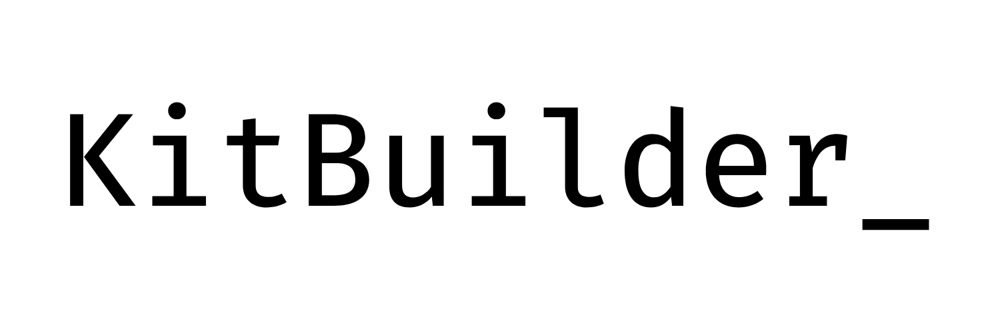

# KitBuilder

 KitBuilder is a library used for generating API-based and CLI-based SDK using only one file!

 It's currently only supported for `Python 3.x`, `Typescript` and `Javascript` but it can be easily implemented using concept explained in docs.
